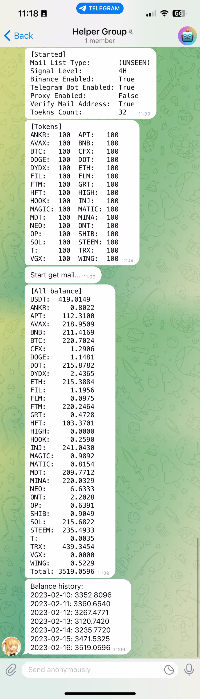

## Transaction Bot

Get market signals from https://www.bi123.co and auto-make orders in Binance.

## Preparation

Add the config file in the project folder:

- Add a file named `config.py` or execute the command `cp config-example.py config.py`

Receive signal mail from bi123:

- Register in bi123.co by mail
- Open mail push in bi123.co
- Setup mail server info in `config.py`

Make order automation in Binance:

- Register an account in Binance
- Get the API token in Binance and setup in `config.py`

Push action to telegram bot:

- Get a bot and get the control token and group chat id
- Setup in `config.py`

## Usage

Install:

```
pip install python-binance
pip install -r requirements.txt
```

Run:

```
python main.py
```

## Configuration

`config.py` format:

```
mail_address = ''
mail_password = ''
mail_server = ''
mail_server_port = 0

# 'ALL' or '(UNSEEN)'
mail_list_type = '(UNSEEN)'

mail_address_verify = True
mail_address_from = b'<subscription@bi123.co>'
# 1H 4H 1D
mail_level = '4H'

telegram_enable = True
telegram_api_token = ''
telegram_chat_id = ''

proxy_enable = False
proxy_http = 'socks5://127.0.0.1:7891'
proxy_https = 'socks5://127.0.0.1:7891'

binance_enable = True
biance_api_key = ''
biance_secrect_key = ''

# USDT
tokens = {
    "ETH": 11,
    "DOGE": 11,
    "SHIB": 11
}
token_remain_rate = 0.995
```

## Preview


